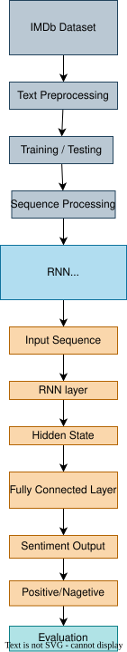
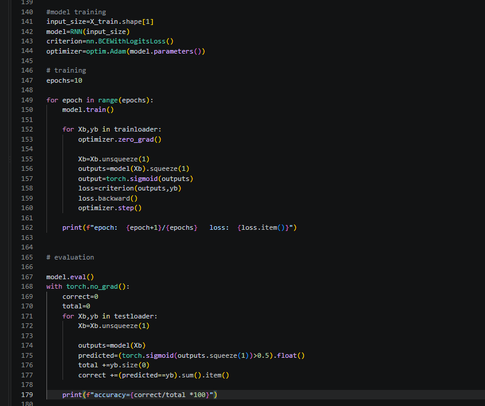
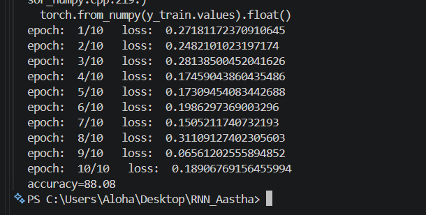
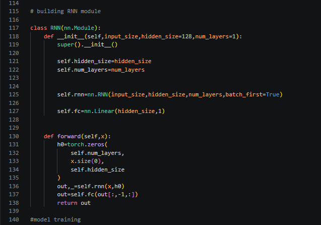

<div align="center">

# 🎬 IMDb Sentiment Analysis using RNN

### Binary Sentiment Classification using Recurrent Neural Networks and PyTorch

A Natural Language Processing project that analyzes IMDb movie reviews and classifies them as **Positive** or **Negative** using **TF-IDF feature extraction** and a **PyTorch Recurrent Neural Network (RNN)**.

<p align="center">


</p>

</div>

---

# 📖 Overview

The **IMDb Sentiment Analysis** project is a Natural Language Processing and Deep Learning project that predicts the sentiment of movie reviews as either **Positive** or **Negative**.

The project uses the **IMDb Movie Review Dataset**, containing **50,000 movie reviews**, and demonstrates a complete text classification workflow including:

* Text preprocessing
* HTML and URL removal
* Punctuation removal
* Stopword removal
* Stemming
* Sentiment encoding
* TF-IDF vectorization
* Train-test splitting
* PyTorch TensorDataset and DataLoader
* Recurrent Neural Network implementation
* Binary sentiment classification
* Model training
* Model evaluation
* Accuracy calculation

The project is implemented using **Python, NLTK, Scikit-Learn, and PyTorch**.

---

# ✨ Features

* 🎬 IMDb movie review sentiment classification
* 📂 IMDb dataset processing
* 🧹 Text cleaning and preprocessing
* 🔗 URL removal
* 🏷 HTML tag removal
* ✂️ Punctuation removal
* 🚫 Stopword removal
* 🌱 Porter stemming
* 🔢 Label encoding
* 📊 TF-IDF feature extraction
* 🧠 PyTorch RNN model
* ⚙️ Mini-batch training using DataLoader
* 📈 Binary Cross-Entropy loss with logits
* 🧪 Train-test split
* 📊 Model accuracy evaluation
* 🖼️ RNN architecture visualization
* 📸 Training and evaluation screenshots

---

# 🔄 Project Workflow

<div align="center">

The overall workflow of the project is:




</div>


```

> 📄 The editable RNN architecture diagram is available in [`rnn_arch.drawio`](rnn_arch.drawio).

---

# 🧠 RNN Architecture

The project implements a Recurrent Neural Network using PyTorch.

The model consists of:

```text
Input Features
      ↓
PyTorch RNN
      ↓
Hidden State
      ↓
Fully Connected Layer
      ↓
Output
      ↓
Sigmoid
      ↓
Positive / Negative
```

### Model Configuration

| Component        | Configuration     |
| ---------------- | ----------------- |
| Framework        | PyTorch           |
| RNN Type         | `nn.RNN`          |
| Hidden Size      | 128               |
| Number of Layers | 1                 |
| Batch First      | True              |
| Output Layer     | Linear            |
| Output Size      | 1                 |
| Loss Function    | BCEWithLogitsLoss |
| Optimizer        | Adam              |
| Epochs           | 10                |
| Batch Size       | 64                |

---

# 📊 Dataset

The project uses the **IMDb Dataset**, containing **50,000 movie reviews** divided into two sentiment classes:

| Sentiment | Description           |
| --------- | --------------------- |
| Positive  | Positive movie review |
| Negative  | Negative movie review |

The dataset is processed before being passed to the machine learning pipeline.

### Dataset Processing

The reviews undergo the following preprocessing steps:

1. Convert text to lowercase
2. Remove URLs
3. Remove punctuation
4. Remove HTML tags
5. Remove English stopwords
6. Apply Porter stemming
7. Convert sentiment labels into numerical values

---

# 🧹 Text Preprocessing

Natural language text contains unnecessary characters and words that can affect model training.

The project performs several preprocessing operations before vectorization.

### Preprocessing Pipeline

```text
Raw Review
    ↓
Lowercase
    ↓
Remove URLs
    ↓
Remove HTML Tags
    ↓
Remove Punctuation
    ↓
Remove Stopwords
    ↓
Stemming
    ↓
Clean Review
```

### NLP Libraries

The project uses **NLTK** for:

* Word tokenization
* English stopword removal
* Porter stemming

---

# 📊 TF-IDF Vectorization

After preprocessing, the text is converted into numerical features using **TF-IDF (Term Frequency-Inverse Document Frequency)**.

The project uses:

```python
TfidfVectorizer(max_features=5000)
```

This limits the feature space to the **5,000 most important features**.

The resulting numerical representation is then converted into PyTorch tensors for model training.

---

# 🏋️ Training and Evaluation

The dataset is divided into training and testing sets using:

```python
train_test_split(
    X,
    y,
    test_size=0.2,
    random_state=42
)
```

This creates:

```text
80% → Training Data
20% → Testing Data
```

The training data is loaded using PyTorch's `DataLoader` with a batch size of **64**.

The model is trained for **10 epochs** using:

```text
Loss Function → BCEWithLogitsLoss
Optimizer     → Adam
```

---

# 📈 Training and Evaluation Code

<div align="center">



</div>

The training screenshot shows the model's loss values during the training process along with the evaluation output.

---

# 🎯 Accuracy

<div align="center">



</div>

The trained model is evaluated on the test dataset and the final classification accuracy is calculated using the predicted sentiment labels.

The evaluation process compares the predicted labels with the actual sentiment labels.

---

# 🧠 RNN Implementation

<div align="center">



</div>

The RNN model is implemented as a custom PyTorch `nn.Module`.

The architecture contains:

* PyTorch RNN layer
* Hidden state initialization
* Fully connected output layer
* Sigmoid-based binary classification during evaluation

---

# 🛠 Technologies Used

| Category                    | Technology               |
| --------------------------- | ------------------------ |
| Programming Language        | Python                   |
| Deep Learning               | PyTorch                  |
| Natural Language Processing | NLTK                     |
| Machine Learning            | Scikit-Learn             |
| Data Processing             | Pandas                   |
| Numerical Computing         | NumPy                    |
| Text Vectorization          | TF-IDF                   |
| Neural Network              | Recurrent Neural Network |
| Dataset                     | IMDb Movie Reviews       |
| Architecture Design         | Draw.io                  |
| Version Control             | Git & GitHub             |

---

# 📂 Project Structure

```text
IMDb-Sentiment-Analysis/
│
├── screenshot/
│   ├── accuracy.png
│   ├── class_rnn.png
│   └── model training &eval.png
│
├── IMDB Dataset.csv
│
├── sentiment_analysis.py
│
├── rnn_arch.svg
│
├── rnn_arch.drawio
│
├── README.md
│
├── requirements.txt
│
├── LICENSE
│
└── .gitignore
```

### 📁 File Description

| File / Folder           | Description                                                                      |
| ----------------------- | -------------------------------------------------------------------------------- |
| `sentiment_analysis.py` | Main Python script containing preprocessing, TF-IDF, RNN training and evaluation |
| `IMDB Dataset.csv`      | IMDb movie review dataset used for sentiment classification                      |
| `rnn_arch.svg`          | RNN architecture visualization                                                   |
| `rnn_arch.drawio`       | Editable Draw.io architecture diagram                                            |
| `screenshot/`           | Project screenshots and results                                                  |
| `requirements.txt`      | Python dependencies                                                              |
| `.gitignore`            | Files excluded from Git tracking                                                 |
| `LICENSE`               | Project license                                                                  |
| `README.md`             | Project documentation                                                            |

> **Note:** If `IMDB Dataset.csv` is excluded using `.gitignore`, the dataset will remain available locally but will not be uploaded to GitHub.

---

# 📦 Requirements

The project uses the Python libraries listed in `requirements.txt`.

Core dependencies include:

```text
pandas
numpy
scikit-learn
torch
nltk
```

Install all dependencies using:

```bash
pip install -r requirements.txt
```

For NLTK resources, download the required packages:

```python
import nltk

nltk.download("punkt")
nltk.download("punkt_tab")
nltk.download("stopwords")
```

---

# 🚀 Installation

### 1. Clone the Repository

```bash
git clone https://github.com/K-Aas-tha/IMDb-Sentiment-Analysis.git
```

### 2. Move into the Project Directory

```bash
cd IMDb-Sentiment-Analysis
```

### 3. Install Dependencies

```bash
pip install -r requirements.txt
```

### 4. Download NLTK Resources

Run:

```python
import nltk

nltk.download("punkt")
nltk.download("punkt_tab")
nltk.download("stopwords")
```

### 5. Run the Project

```bash
python sentiment_analysis.py
```

The script will preprocess the reviews, create TF-IDF features, train the RNN model and evaluate its accuracy on the test dataset.

---

# 🔮 Future Improvements

The project can be further improved by:

* 🧠 Using an Embedding layer instead of TF-IDF features
* 🔄 Implementing sequence-based RNN processing
* 🧠 Experimenting with LSTM and GRU architectures
* 📊 Adding precision, recall and F1-score
* 📉 Adding a confusion matrix
* ⚙️ Hyperparameter tuning
* 🔁 Cross-validation
* 📈 Training and validation loss graphs
* 🌐 Creating a Streamlit web application
* ☁️ Deploying the model
* 🚀 Improving inference performance
* 💾 Saving and loading trained model weights

---

# 📜 License

This project is licensed under the **MIT License**.

See the [`LICENSE`](LICENSE) file for complete license details.

---

# 👩‍💻 Author
<div align="center">

## Aastha Nayak

•Machine Learning • Python • Deep Learning • NLP

<p>
💡 Open to collaboration on Machine Learning, Python, and AI projects.
</p>

<p>

<a href="https://github.com/K-Aas-tha">

</a>


<a href="mailto:aasthanayak161@gmail.com">

</a>

<a href="https://www.linkedin.com/in/aastha-nayak-76bb7a34b">

</a>

</p>

### ⭐ If you found this project helpful, consider giving it a Star!

Made with ❤️ using **Python, NLP & Recurrent Neural Networks**
</div>